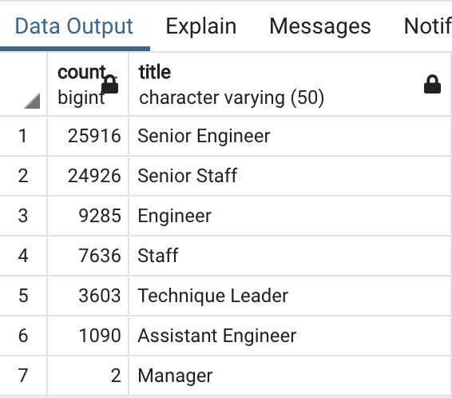
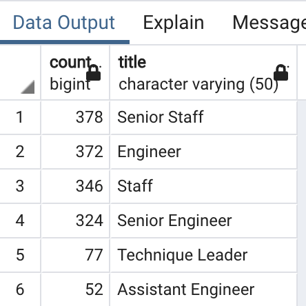

# Pewlett-Hackard-Analysis
##Background
Now that Bobby has proven his SQL chops, his manager has given both of you two more assignments: determine the number of retiring employees per title, and identify employees who are eligible to participate in a mentorship program. Then, you’ll write a report that summarizes your analysis and helps prepare Bobby’s manager for the “silver tsunami” as many current employees reach retirement age.

## Results

### Number of Retiring Employees By Title 

The upcoming "silver tsunami." Will impact 72458 roles with following impact by role 

### Mentorship Eligibility 

## Summary

- PH is definitely facing a challenge as there are 72458 roles that will be retiring. However there is a chance that not all the roles require backfill as technology and industry could have become more efficient. So an analysis will need to be performed on this area 

- As of the mentorship program. Looks like we have 1549 eligible employees to participate, and might not be enough given the numbers of new next generation to come. 